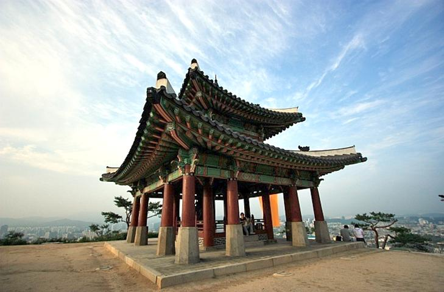

# Low-Light-Image-Enhancement
Python implementation of "[A New Image Contrast Enhancement Algorithm Using Exposure Fusion Framework](https://baidut.github.io/OpenCE/caip2017.html)"

### Requirements
- scipy
- numpy
- imageio
- matplotlib
- cv2

### Results

  
  
  
  

  
  

  
  

