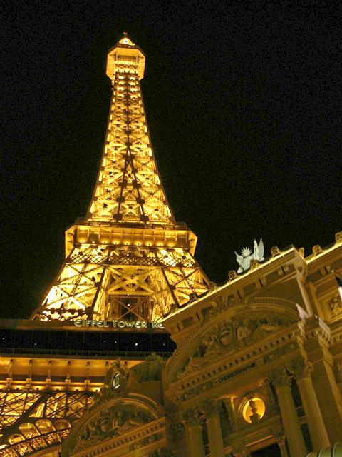

# Image-Contrast-Enhancement
Python implementations of "[A New Image Contrast Enhancement Algorithm Using Exposure Fusion Framework](https://baidut.github.io/OpenCE/caip2017.html)"

### Already Implemented
- histogram equalization(he)
- dynamic histogram equalization(dhe)
- A New Image Contrast Enhancement Algorithm Using Exposure Fusion Framework

### Requirements
- scipy
- numpy
- imageio
- matplotlib
- cv2
- skimage

### Usage
If you want the result of "[A New Image Contrast Enhancement Algorithm Using Exposure Fusion Framework](https://baidut.github.io/OpenCE/caip2017.html)"
```
python ying.py <input image>
```
If you want the result of "[A Dynamic Histogram Equalization for Image Contrast Enhancement](https://ieeexplore.ieee.org/document/4266947/)"
```
python dhe.py <input image>
```
If you want the result of histogram equalization
```
python he.py <input image>
```

### Results
<p align='center'>
  
  
  
  
</p>

<p align='center'>
  
  
</p>

<p align='center'>
  
  
</p>
